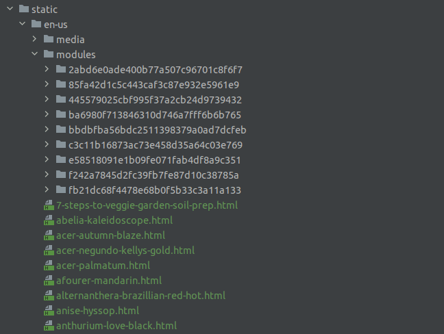
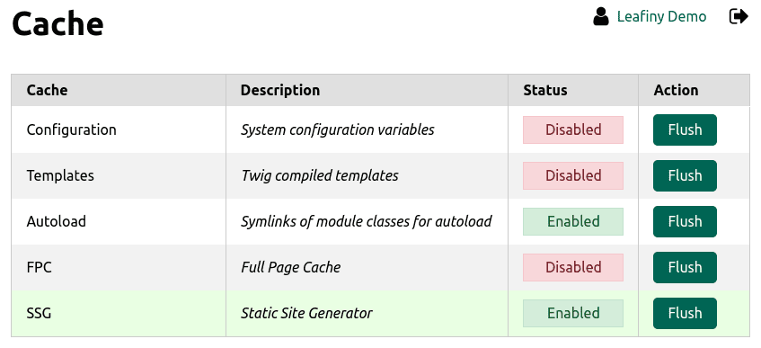

# Leafiny_Ssg

The module allows to generate a static version of the website.



# Requirement

Leafiny >= 1.9.1

# Installation

Copy `Leafiny_Ssg` into your Leafiny `modules` directory.

# Example

Go to the [Demo Leafiny Static Website](https://demo.en.static.leafiny.com/). This is a static website built from the official Leafiny demo website.

# Configuration

In the global config file (ex: `etc/config.dev.php`), enable SSG and add the static site host for all languages:

```php
$config = [
    /* ... */
    'helper' => [
        'ssg' => [
            'enabled' => 1,
            'host' => [
                'fr_FR' => 'fr.example.com',
                'en_US' => 'en.example.com',
            ],
            'generator' => [
                'identifiers' => [
                    '/',
                    '/notfound.html',
                ],
            ]
        ],
        /* ... */
    ],
    /* ... */
];
```

# Pages

## Custom pages

All pages added in your custom modules must be specified in the **ssg > generator > identifiers** configuration key:

```php
$config = [
    /* ... */
    'helper' => [
        'ssg' => [
            /* ... */
            'generator' => [
                'identifiers' => [
                    '/',
                    '/notfound.html',
                    'custom-page.html',
                ],
            ]
        ],
        /* ... */
    ],
    /* ... */
];
```

The "**/**" identifier is the homepage.

## Entities

Static pages for entities are added or updated when an entity (category, page, post, product) is saved.

# Generator

## Resources

Deploy all the resources (css, script, images...) with the native deployment script (deploy.php).

```
deploy.php {strategy} {directory}
```

You can use 2 deployments strategy:

- **symlink:** the host docroot is the static site directory, and you want to update the site in real time from the admin
- **copy:** the while site must be exported for be hosted anywhere

Deploy the resources for all the languages:

```
php deploy.php symlink static/en-us
php deploy.php symlink static/fr-fr
```

The symlink deployment script will run only once, or when a new module is added.

```
php deploy.php copy static/en-us
php deploy.php copy static/fr-fr
```

The copy deployment script will run each time you want to deploy the site.

**Note:** for security reasons, resources will never be programmatically removed. Feel free to remove the static site directory and start a new deployment.

## Pages

Generate the whole static site from the backend: **Admin > Cache**

Flush the SSG:



All the pages will be created in the **static** directory, for each language:

* /static/en-us
* /static/fr-fr